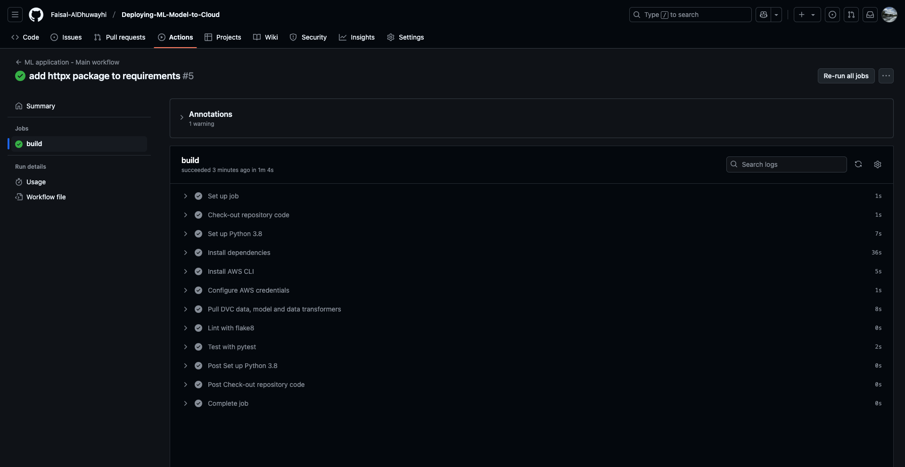
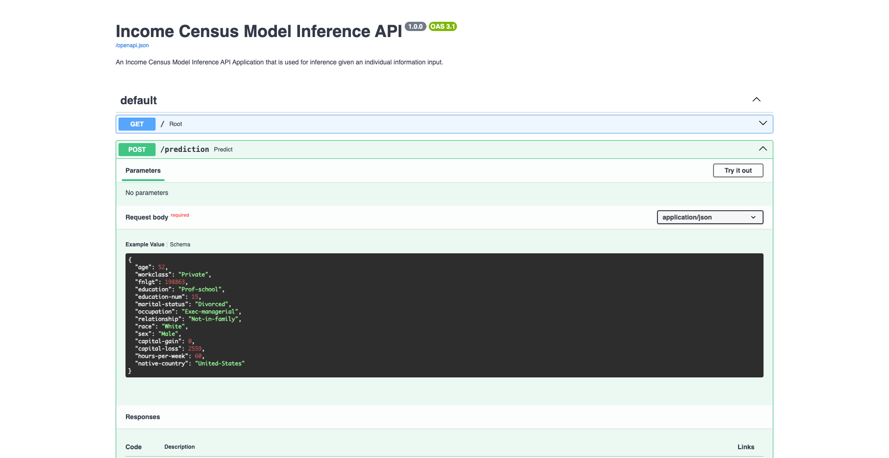
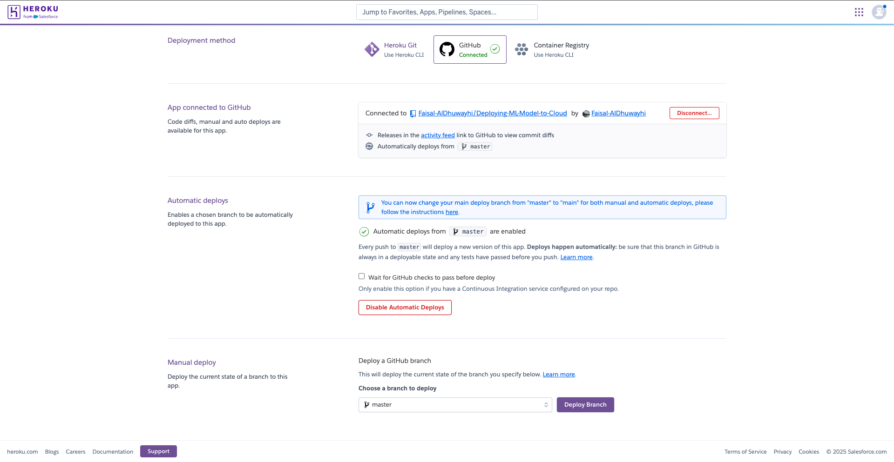

# Deploying ML Model to Cloud
In this project, you will develop a classification model on publicly available [Census Bureau data](https://archive.ics.uci.edu/dataset/20/census+income). You will create unit tests to monitor the model performance on various data slices. Then, you will **deploy your model using the FastAPI package and create API tests**, and then **deploy the entire app to a Cloud** platform such as Heroku. The slice validation and the API tests will be incorporated into a **CI/CD framework** using GitHub Actions.

The project consist of several components and steps that we are going to look into one by one.

## Environment Set up
* Download and install conda if you don’t have it already:
    * Use the requirements file to create a new environment with Python 3.8 version:
  * `pip install -r requirements.txt` 
* Install git either through conda (“conda install git”) or through your CLI, e.g. `sudo apt-get install git`.
* DVC is already installed in your environment through `requirements.txt`, however, you can install it globally in your device if you want.

## Version Control (Git & DVC)
* Initialize Git and DVC.
   * As you work on the code, continually commit changes. 
   * Trained models and data (artifacts) must be committed to DVC.
* Connect your local Git repository to GitHub.

## Set up AWS S3 as DVC Remote Repository  
* Install the <a href="https://docs.aws.amazon.com/cli/latest/userguide/cli-chap-install.html" target="_blank">AWS CLI tool</a>.
* Create an <a href="https://console.aws.amazon.com/iam/" target="_blank">S3 bucket</a>.
* Create Access key and Secret access key from <a href="https://console.aws.amazon.com/iam/" target="_blank">IAM console</a>, and give it **AmazonS3FullAccess** permission to be able to read from the S3 bucket that has been just created. 
* Configure your AWS CLI to use the Access key ID, Secret Access key, and Region.

## GitHub Actions (CI: Continuous Integration)
* Setup a workflow in [GitHub Actions](https://docs.github.com/en/actions) on your repository to run `pytest` and `flake8` on *push* and requires both to pass without error.
* Make sure you set up the GitHub Action to have the same version of Python as you used in development.
* Add your <a href="https://github.com/marketplace/actions/configure-aws-credentials-action-for-github-actions" target="_blank">AWS credentials to the Action</a>.
* Set up <a href="https://github.com/iterative/setup-dvc" target="_blank">DVC in the action</a> and specify a command `dvc pull`.
* You can find it here: `.github/workflows/main.yml`

## Data
* Download the census data from the source `census.csv`.
* Clean the data and remove/fix any noticeable issues `census_clean.csv`.
* Create a remote DVC repository pointing to your S3 bucket and commit the data and models there.
* You can find data dvc files (the original files are in S3) in this folder: `data/`

## Model
* Implement a machine learning model that trains on the clean data, and then save the model.
  * You can find models dvc files (the original files are in S3) in this folder: `model/`
* Write unit tests for at least 3 functions in the model code `tests/test_model.py`.
* Check the performance of the model on slices of the data `starter/slices.py` & `results/slice_output.txt`.
* Write a model card `model_card.md`.

## API Creation
* Create a RESTful API App using FastAPI that implements `main.py`:
   * GET on the root giving a welcome message.
   * POST that does model inference.
   * Type hinting using Pydantic.
* Write 3 unit tests to test the API (one for the GET and two for POST, one that tests each prediction) `tests/test_api.py`.
* Run `sanitycheck.py` to verify that your API test cases are written as expected.

## API Deployment
* This project uses [Heroku](https://www.heroku.com/) as a Cloud Platform Provider for deployment.
* Create a Heroku account (for the next steps, you can either use the web GUI or install the [Heroku CLI](https://devcenter.heroku.com/articles/heroku-cli)).
* Create a new app and have it deployed from your GitHub repository.
   * Enable automatic deployments that only deploy if your continuous integration passes **(CD: Continuous Deployment)**.
* Set up [DVC](https://ankane.org/dvc-on-heroku) & [AWS](https://elements.heroku.com/buildpacks/heroku/heroku-buildpack-awscli) on Heroku leveraging the [buildpacks](https://elements.heroku.com/buildpacks) functionality.
* Configure access to AWS on Heroku (Config Vars), if using the CLI: 
  * `heroku config:set AWS_ACCESS_KEY_ID=xxx AWS_SECRET_ACCESS_KEY=yyy AWS_DEFAULT_REGION=zzz`
* Use `Procfile` to specify the commands of running the deployed app.
* Verify that the deployed application is working by POST requesting on your live API `verify_model_deploy.py`.

